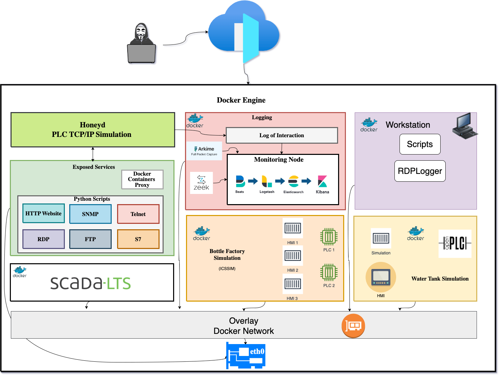

# VIRTUEPOT an ICS Honeypot
A high-interaction virtual ICS honeypot that simulates a PLC and provides physical process simulation.

The above-mentioned diagram shows the draft copy of the architecture 

## Installation

### Prerequisites

**OS requirements**

To install Docker Engine, you need the 64-bit version of one of these Ubuntu versions:

* Ubuntu Jammy 22.04 (LTS)
* Ubuntu Focal 20.04 (LTS)
* Ubuntu Bionic 18.04 (LTS)

Docker Engine is compatible with x86_64 (or amd64), armhf, arm64, and s390x architectures.

* [Install Docker](./doc/docker.md)
* [Installation of Zeek (Monitoring Node)](./doc/zeek.md)
* [Installation of OpenPLC (Running Water Tank)](./doc/openplc.md)
* [Installation of ICSSIM (Running Bottle Factory)](./doc/icssim.md)
* [Installation of Scada ](./doc/scada.md)
* [Installation of HoneyD ](./doc/honeyd.md)