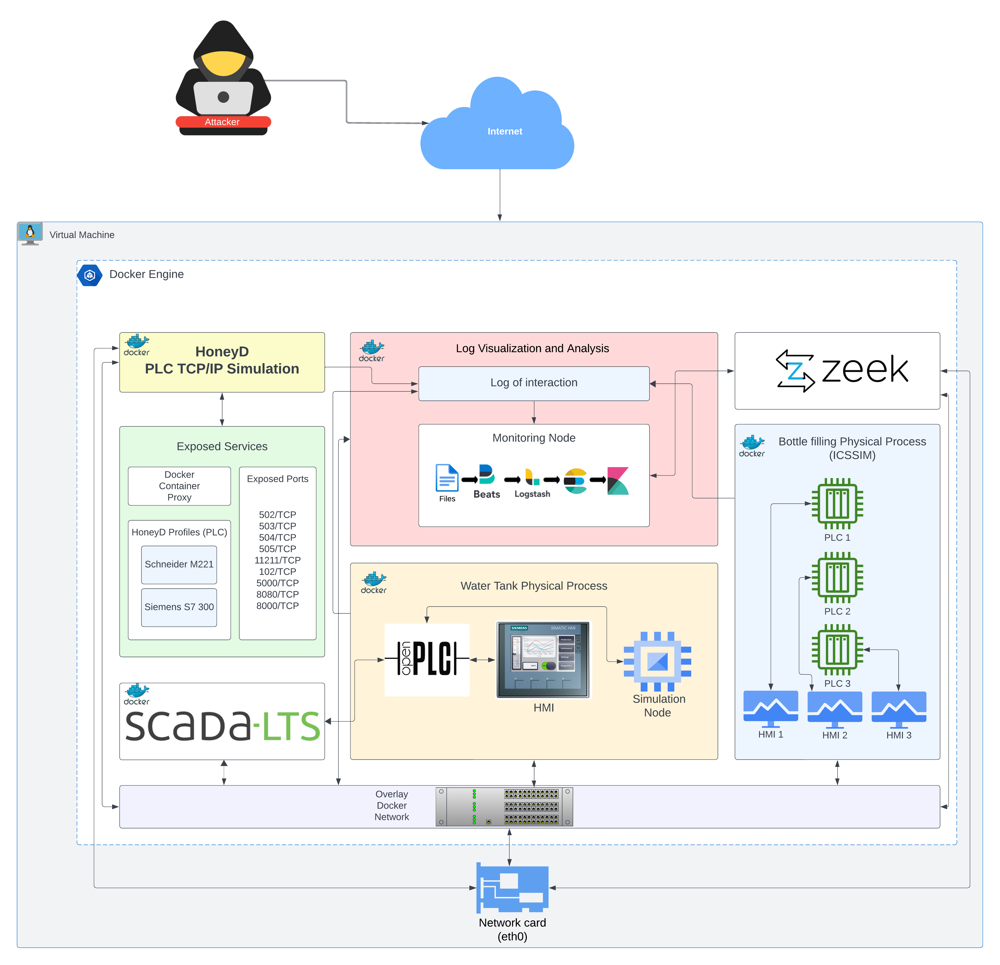

<div id="top"></div>
<!-- PROJECT LOGO -->
<br />
<div align="center">
  <a href="https://github.com/Mhackiori/STIXnet">
    
  </a>

  <h1 align="center">VIRTUEPOT</h1>

  <p align="center">
    VIRTUEPOT: A High-Fidelity and High-Interaction Virtual Honeypot for Industrial Control Systems
    <br />
    <a href=""><strong>Thesis available »</strong></a>
    <br />
    <br />
    <a href="https://www.math.unipd.it/~conti/">Mauro Conti</a>
    ·
    <a href="https://www.math.unipd.it/~turrin/">Federico Turrin</a>
    ·
    <a href="https://www.linkedin.com/in/nikhilkc/">Nikhil Karakuchi Chidananda</a>
  </p>
</div>

<div id="abstract"></div>

## 📇 Abstract

>Industrial Control Systems (ICS) are crucial in managing and supervising a wide range of industrial activities, including those in energy, manufacturing, and transportation. However, as
these systems’ interconnection and digitalization increase, new cybersecurity concerns emerge, rendering them vulnerable to cyberattacks. To address these issues, this thesis investigates using honeypots as a proactive cybersecurity tool for protecting Industrial Control Systems. A honeypot is an effective standard tool to study attacks against the industrial control system
and defense methods to protect from attackers. nowadays the ICS industry faces an increasing number of cyber threats, and the attacker’s capabilities become much better It become more
challenging to create a honeypot that can be capable of detecting and responding to such an attack and efficiently logging the interactions and capturing the changes in the physical process. With our proposal we aimed to learn more about the attack patterns and behavior by use of the honeypot, we can get valuable Information about the latest Tactics, Techniques, and Procedures for attacks and their technical knowledge, and abilities. In this thesis, we presented a Virtuepot honeypot that mainly focuses on the physical interac tion and design of honeypots that properly simulate the behavior and services of real PLCs using dynamic service simulations. This might include more advanced simulations of industrial processes, communication protocols, and command responses. We deployed our honeypot in both the cloud and locally on-premise in VSIX Internet Exchange Point and collected the data for 61 days. The Honeypot experiment showed that the on-premise machine attracted more realistic attacks compared to cloud deployment.

<b>Keywords:</b> Cyber-physical system (CPS); Honeypot; Programmable Logic Controller (PLC); Industrial Control Systems (ICS); SCADA.


## 🧱 Architecture 



## ⚙️ Installation

### Prerequisites

**OS requirements**

To install Docker Engine, you need the 64-bit version of one of these Ubuntu versions:

* Ubuntu Jammy 22.04 (LTS)
* Ubuntu Focal 20.04 (LTS)
* Ubuntu Bionic 18.04 (LTS)

Docker Engine is compatible with x86_64 (or amd64), armhf, arm64, and s390x architectures.

* [Install Docker](./doc/docker.md)

In order to install the honeypot, clone this repo and execute init.sh using the command:

```bash
git clone https://github.com/0xnkc/virtuepot/
cd virtuepot
```


```bash
chmod +x init.sh

./init.sh
```

<p align="right"><a href="#top">(back to top)</a></p>
